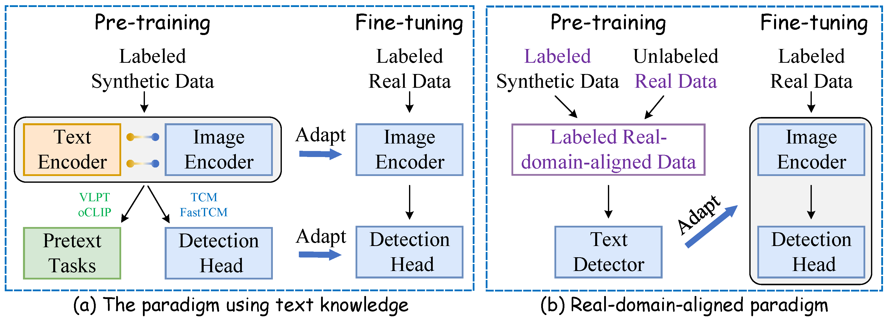

# FreeReal

<h3 align="center"> <a href="https://arxiv.org/pdf/2312.05286">FreeReal: Bridging Synthetic and Real Worlds for Pre-training Scene Text Detectors</a></h3>


<h5 align="center">

[](https://arxiv.org/pdf/2312.05286)
[](https://github.com/SJTU-DeepVisionLab/FreeReal/blob/main/poster_FreeReal.png)
</h5>

In this work, we propose FreeReal, a real-domain-aligned pre-training paradigm that enables the complementary strengths of both LSD and unlabeled real data (URD).
Specifically, to bridge real and synthetic worlds for pre-training, a glyph-based mixing mechanism (GlyphMix) is tailored for text images. GlyphMix delineates the character structures of synthetic images and embeds them as graffiti-like units onto real images. Without introducing real domain drift, GlyphMix freely yields real-world images with partial annotations derived from synthetic labels. Furthermore, when given free fine-grained synthetic labels, GlyphMix can effectively bridge the linguistic domain gap stemming from English-dominated LSD to URD in various languages. Without bells and whistles, FreeReal achieves average gains of 1.97%, 3.90%, 3.85%, and 4.56% in improving the performance of FCENet, PSENet, PANet, and DBNet methods, respectively, consistently outperforming previous pre-training methods by a substantial margin across four public datasets.

<br>
<p align="center">
    
<p>

<h2></h2>

## News 
* Code will be released soon.
* ```2024.7.13 ``` 🚀 Release paper [FreeReal](https://arxiv.org/pdf/2312.05286).
* ```2024.7.4 ``` 🚀 Accepted by ECCV2024.

## Framework

Overall framework of our method.

<p align="center">
    
<p>

Overall framework of GlyphMix method.

<p align="center">
    
<p>

<!-- # Visualization

<p align="center">
    
<p> -->

## Getting Started

- ### Installation
```shell
conda create -n GTK python=3.8
conda install pytorch==1.12.1 torchvision==0.13.1 torchaudio==0.12.1 cudatoolkit=11.3 -c pytorch
pip3 install openmim
mim install mmengine
mim install mmcv
mim install mmdet
mim install -e . (install mmocr)
conda install tensorboard
# python -m pip install visualdl -i https://mirror.baidu.com/pypi/simple
```

### Data Preparation
Download all the datasets and make sure you organize them as follows

```
- datasets
  | - URD
  |   | - ArT
  |   | - ICDAR2013
  |   | - LSVT
  |   | - MLT17
  |   | - MLT19
  |   | - USTB-SV1K
  | - LSD
  |   | - SynthText
```


### Pre-Training 
```
CUDA_VISIBLE_DEVICES=0,1 python -m torch.distributed.launch --master_port 29506 --nproc_per_node=2 pretrain.py --model_name DB --device ailab --stage stage2 --data_portion=0.2 --global_name pretrain --vis_iteration 500 --batch_size 24 --num_workers 8 --char_mode True
```
### Finetuning
The checkpoint can be directly loaded into [mmocr-1.x](https://github.com/open-mmlab/mmocr/tree/1.x), and run the following command:
```
bash tools/dist_train.sh configs/textdet/dbnet/_base_dbnet_resnet50_fpnc_tt.py /path/checkpoint.pth 2
```
### Evaluation
```
bash tools/dist_test.sh configs/textdet/dbnet/_base_dbnet_resnet50_fpnc_tt.py /path/xxx.pth 2
```

## Cite
If you find our method useful for your reserach, please cite

```BibTeX
@article{guan2023bridging,
  title={Bridging Synthetic and Real Worlds for Pre-training Scene Text Detectors},
  author={Guan, Tongkun and Shen, Wei and Yang, Xue and Wang, Xuehui and Yang, Xiaokang},
  journal={arXiv preprint arXiv:2312.05286},
  year={2023}
}
```

## License
This code are only free for academic research purposes and licensed under the 2-clause BSD License - see the LICENSE file for details.


